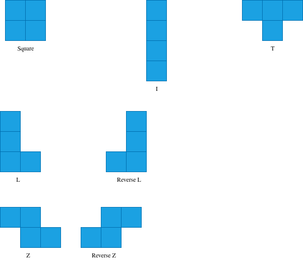

# tetris

It has 2 parts - api and gui.

## API

Gui access the game api using `Game` structure. This structure exposes few methods.

Following methods are exposed:

1. `CreateGame(rows, columns)`: It takes number of `rows` and `columns` that the game playground will have (excluding the wall).
2. `GetWallCoordinates()`: It returns the coordinates of the wall around the playground. GUI will use these coordinates to draw the wall at the correct positions. The method returns `[][2]int` which is a list coordinates. The coordinates are in `[row, column]` format.

Following shapes of tetris are possible along with their rotations:

Each piece has it's own name that I gave to make them seperable easily. Following are the shape names I am using in the API:

- Square
- T
- I
- L
- Reverse L
- Z
- Reverse Z